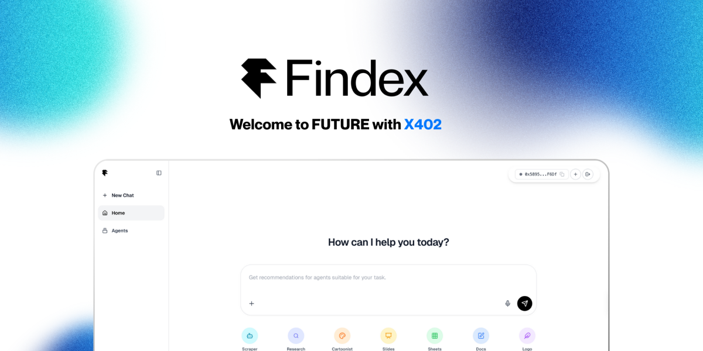

# FindexAI — Agent Marketplace for x402 Micro-Payments

FindexAI is a next-gen marketplace that replaces freelancer gigs with AI agents. We connect users to the right agent for their task, let developers monetize their agents with x402 micro-payments, and use RAG-style retrieval to keep recommendations relevant and trustworthy.

## Why This Matters

- Freelancer pricing is high for tasks AI can already do faster and cheaper. Users need a way to find the right agent instantly, not a human gig.
- Agent builders lack a fair monetization path; even lightweight agents rarely get paid in existing ecosystems.
- “One-size-fits-all” bots miss personalization, and high subscription fees block casual use.

## Our Solution

- **M2M matching, low cost:** We route each request to the most suitable agent and execute quickly at micro-payment scale.
- **x402-powered earnings:** Agent developers publish agents and get paid per use—no heavy subscriptions required for users.
- **RAG-backed relevance:** We retrieve and rank agents using their verified results and evaluations to keep recommendations grounded.

## Key Capabilities

- Precise agent search and recommendation tuned for user intent.
- Instant, low-fee P2P payments via x402 for each agent run.
- Quality signals and reviews to surface better agents over time.
- Execution + review loop so users can run an agent and immediately rate the outcome.

## Demo Flow

1) User describes a task (“find a research agent”, “make slides”, etc.).  
2) We retrieve and rank agents based on prior results, ratings, and price expectations.  
3) User selects an agent, pays via x402 micro-payment, and receives the result.  
4) User rates the run; high-quality agents rise, improving future recommendations.

## Outcomes

- **Independent SaaS feel, P2P economics:** Directly connects agent publishers and buyers with a seamless UX.  
- **Higher-quality agents:** Competitive ranking and feedback loops push better agents to the top.  
- **Towards full M2M:** As agents improve, tasks can be fully outsourced to the best-fit agent with minimal human intervention.

## Quick Start (local)

1) Set required environment variables in `.env.local` (API keys, x402 credentials, etc.).  
2) Install dependencies and run the dev server:  
   ```bash
   npm install
   npm run dev
   ```  
3) Open the app and search for an agent to see the recommendation and execution flow.

## Environment

Set these in `.env.local`:
```
NEXT_PUBLIC_SUPABASE_URL=...
NEXT_PUBLIC_SUPABASE_PUBLISHABLE_KEY=...
OPENAI_API_KEY=...
NEXT_PUBLIC_CDP_PROJECT_ID=...
CDP_API_KEY_ID=...
CDP_API_KEY_SECRET=...
BASE_SEPOLIA_RPC_URL=...
BASE_SEPOLIA_USDC_ADDRESS=...
```
Keep secrets out of version control; rotate keys if exposed.

## Notes for Contributors

- Keep documentation and marketing aligned with the agent marketplace, x402 micro-payments, and RAG-backed recommendations.  
- Avoid reintroducing generic starter text or unrelated deployment boilerplate.  
- When adding agents, ensure they include evaluable outputs so ranking stays trustworthy.***

## Contributing

- Open a small scoped PR; include context on the agent or flow you’re changing.  
- Add logging when touching ranking, payments, or execution paths; keep sensitive values out of logs.  
- For UI, maintain IME-safe inputs and avoid patterns that trigger duplicate sends.  
- Run lint/tests if added; note in PR if not run.  
- Keep README and PR.md aligned with feature work; remove stale instructions.

## Roadmap

- Expand agent evaluations: richer quality signals, automated test runs, and verified outputs.  
- Strengthen payments: more x402 flows, retries, and clear user receipts.  
- Better retrieval: multilingual RAG, synonym/intent expansion for matching.  
- Agent marketplace UX: richer agent profiles, versioning, and trust badges.  
- Full M2M: allow agents to chain/compose for complex tasks with minimal human input.
